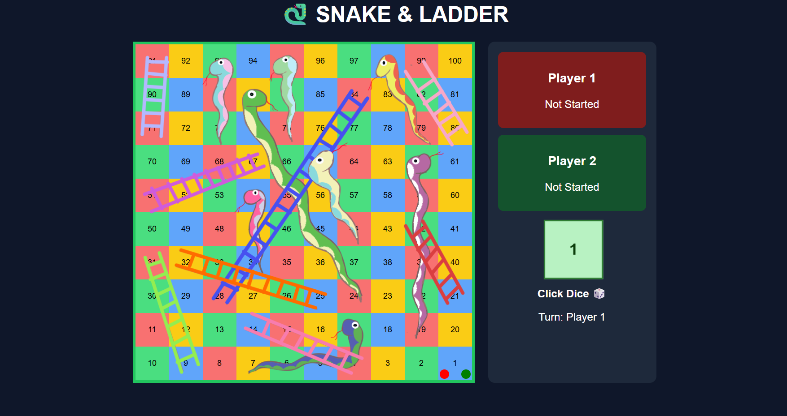
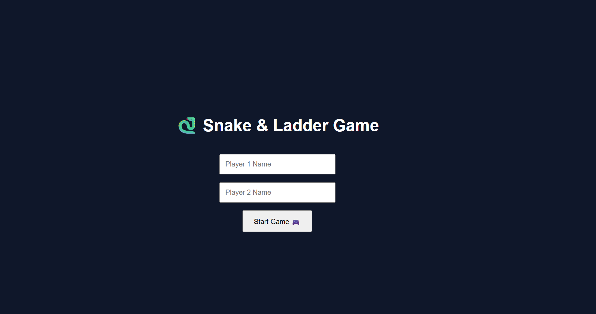

# 🐍 Snake & Ladder Game

A fully interactive Snake & Ladder game built using **HTML, CSS, and JavaScript**, featuring animations, sound effects, and a modern UI.

---

## 🚀 Features

- 🎮 Two-player gameplay
- 🎲 Click-to-roll dice system
- 🔊 Dice, snake, ladder & entry sound effects
- 🪜 Snake & ladder logic with custom paths
- 🚪 Must roll "1" to enter the game
- 🎉 Confetti celebration on win
- 📊 Live player position tracking
- 🎨 Clean UI with animated board

---

## 📸 Screenshots

### 🏠 Home Screen


### 🎮 Game Board


---

## 🕹️ How to Play

1. Enter player names on home screen
2. Click **Start Game**
3. Players must roll **1 to enter the game**
4. Click dice to move
5. Follow snakes 🐍 and ladders 🪜
6. First player to reach **100 wins 🏆**

---

## 🛠️ Tech Stack

- HTML5
- CSS3
- JavaScript (Vanilla)
- DOM Manipulation
- Audio API (for sound effects)

---

## 📁 Project Structure

```text id="project_structure"
snake-ladder-game/
│
├── index.html
├── style.css
├── script.js
├── README.md
│
├── images/
│   ├── home-screen.png
│   └── game-board.png
│
└── sounds/
    ├── dice-roll.mp3
    ├── ladder.mp3
    ├── snake.mp3
    └── enter.mp3